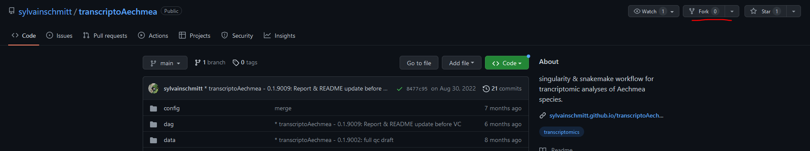
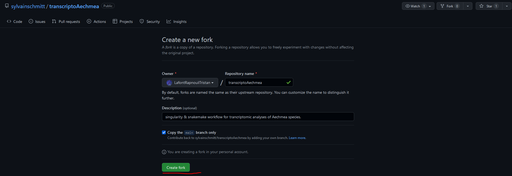
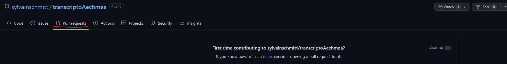

# [User's guide for Ecofog's Ecophysiology Lab](https://GitHubID.github.io/Repository//index.html)

This is the user's guide containing all protocols and informations related with plants measurements performed at EcoFoG.
The goal is to have one common protocol resource for all researcher and students working on similar questions with similar tools.
As authors are involved in bacterial and fungal metabarcoding project we might add a metabarcoding chapter :)!

You are invited to contribute using Pull requests in github.

To freely propose modifications you can click on `fork` (top right of your screen).

It will create a new repository on your account:

You can modify files at will. 
Once done you can ask the repository admin for a `pull`.

Your modifications will be examined and if good enough, accepted by the administrator.

To ensure good functioning we invite you to only modify chapters files (`.rmd`) starting with numbers (*e.g*, 02-architecture or 06-fluxes_and_gaz_exchanges).
You can also add resources (protocol pdf or supporting images in the `document` folder.

[Read online](https://lafontrapnouiltristan.github.io/EcoPhyCofoG_guide/)
